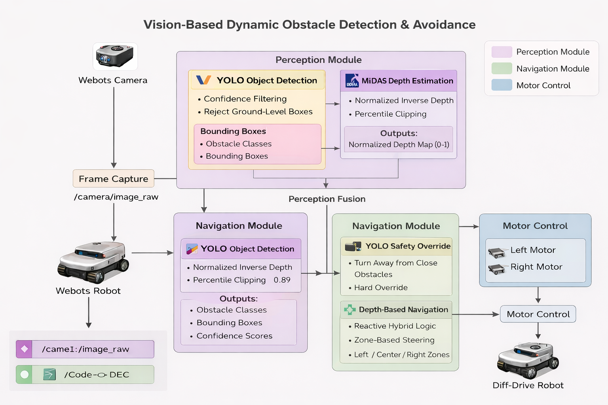
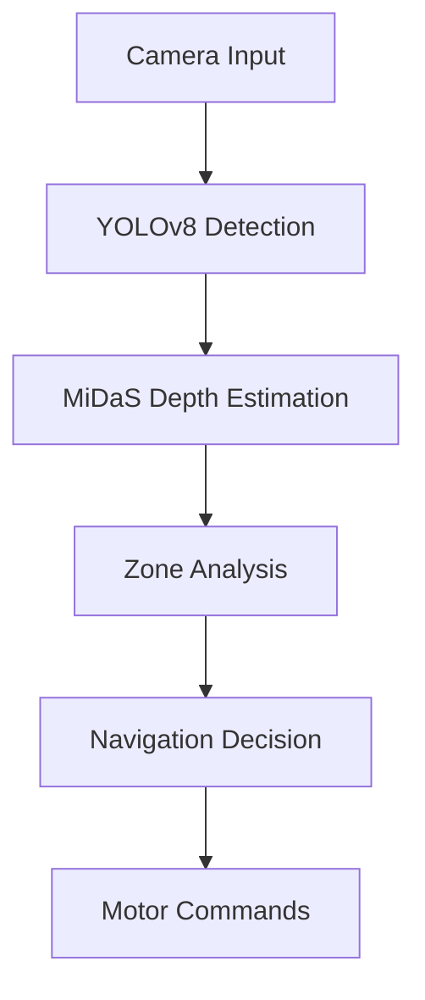

# 🚀 Vision-Based Dynamic Obstacle Detection & Avoidance

### 🤖 Pioneer 3-DX | 🌐 Webots | 👁️ YOLOv8 + 🌊 MiDaS

<p align="center">
  
</p>

---

## 🏷️ Badges

<p align="center">


</p>

---

## 📌 Overview

This project implements a **real-time autonomous navigation system** using **computer vision + AI** for obstacle detection and avoidance.

💡 The robot intelligently understands:

* **What is in front of it** → via YOLOv8
* **How far it is** → via MiDaS
* **How to react** → via Braitenberg logic

---

## 🎯 Key Highlights

✨ Real-time perception-to-action pipeline

✨ Monocular depth estimation (no LiDAR!)

✨ Hybrid AI + reactive control system

✨ Efficient & optimized for simulation

---

## 🧠 System Architecture

<p align="center">
  
</p>

```text
Camera → YOLOv8 → MiDaS → Navigation Controller → Motors
```

---

## ⚙️ Core Components

### 👁️ Object Detection — YOLOv8

* Detects obstacles in real-time
* Filters noise using confidence thresholds
* Focuses on relevant object classes

---

### 🌊 Depth Estimation — MiDaS

* Converts RGB → Depth Map
* Normalized output (0 = far, 1 = near)
* Percentile-based smoothing

---

### 🧠 Navigation Controller

Hybrid intelligence system:

#### 🔴 YOLO Safety Override

* Immediate reaction to close obstacles
* Hard turns for collision avoidance

#### 🟡 Depth-Based Steering

* Divides view into:

  * Left
  * Center
  * Right
* Smooth navigation using depth gradients

---

## 🚦 Robot Behaviors

| Mode                  | Description         |
| --------------------- | ------------------- |
| 🟢 FORWARD            | Clear path          |
| 🟡 STEER_LEFT / RIGHT | Minor correction    |
| 🟠 TURN_LEFT / RIGHT  | Moderate obstacle   |
| 🔴 HARD_LEFT / RIGHT  | Emergency avoidance |
| 🚨 YOLO_OVERRIDE      | Critical detection  |

---

## 📊 Working Pipeline



---

## ⚡ Performance Optimizations

* 🔁 Frame skipping (`INFERENCE_INTERVAL`)
* 🧮 Depth normalization (percentiles)
* 🎯 Selective object filtering
* ⚙️ Efficient NumPy operations

---

## 🛠️ Tech Stack

* 🐍 Python
* 🤖 Webots
* 🔥 PyTorch
* 👁️ OpenCV
* 📦 Ultralytics YOLOv8
* 🌊 Intel MiDaS

---

## ▶️ How to Run

```bash
git clone https://github.com/ymp7/vision-based-obstacle-avoidance.git
cd vision-based-obstacle-avoidance
pip install -r requirements.txt
```

### Steps:

1. Open **Webots**
2. Load Pioneer 3-DX world
3. Attach controller:

   ```
   vision_ai_controller.py
   ```
4. ▶️ Run simulation

---

## 🎥 Demo

<p align="center">
  
</p>

---

## 📌 Applications

* 🤖 Autonomous Robots
* 🚗 Self-Driving Systems
* 🏭 Industrial Automation
* 🛰️ Surveillance Robotics
* 🧭 Indoor Navigation

---

## 🔮 Future Enhancements

* 🗺️ SLAM (Mapping + Localization)
* 🧠 Reinforcement Learning Navigation
* 🌍 Sensor Fusion (Multi-camera)
* ⚡ GPU Optimization
* 🛰️ ROS2 Integration

---

## 📁 Project Structure

```bash
.
├── controllers/
├── modules/
├── config/
├── assets/
├── README.md
└── requirements.txt
```

---

## 🤝 Contributing

Pull requests are welcome! For major changes, please open an issue first.

---

## 📄 License

This project is build for research purposes.

---

## 🌟 Show Your Support

If you like this project:

⭐ Star this repo
🍴 Fork it
📢 Share it

---

## 👨‍💻 Author

**YMP7**

---

> 🚀 *“Vision is all you need for intelligent navigation.”*
